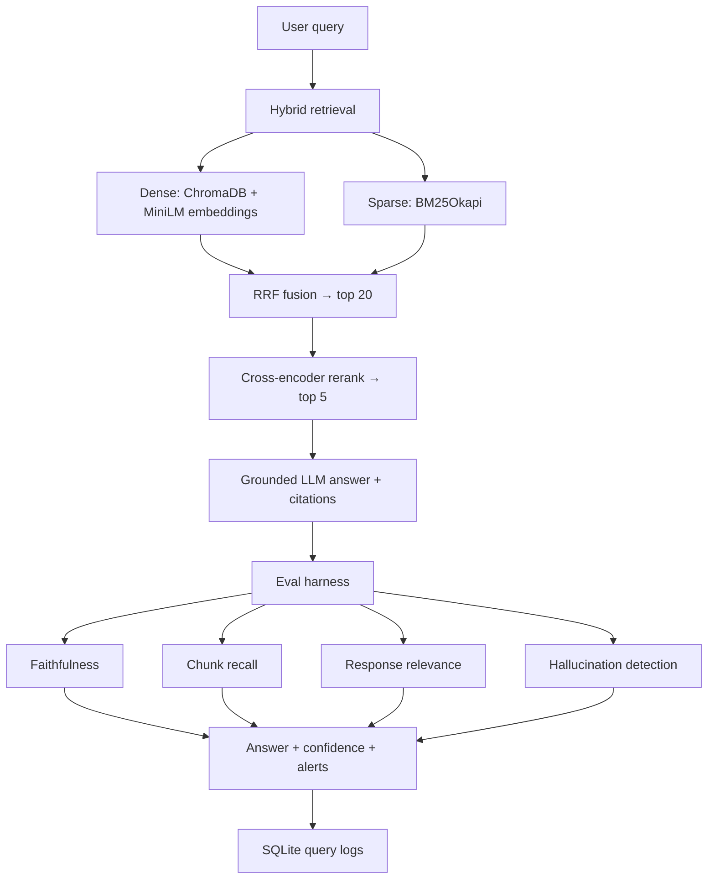

# FinRAG Eval — Financial Document RAG + Evaluation Harness

Production-minded RAG over SEC 10-K / 10-Q filings with **hybrid retrieval**, **cross-encoder reranking**, and a **full evaluation harness** (faithfulness, chunk recall, response relevance, hallucination detection).

Built for financial document Q&A — the domain Capital One, Amex, and asset managers actually ship internally.

**[Live demo →](https://financial-rag-eval.streamlit.app/)** (Streamlit Cloud — requires `OPENAI_API_KEY` in app secrets)

## Architecture



### Anti-hallucination design

| Layer | Mechanism |
|-------|-----------|
| Retrieval | Hybrid dense+BM25 reduces missed-keyword blind spots |
| Reranking | Cross-encoder filters irrelevant chunks before generation |
| Generation | Strict system prompt; mandatory chunk citations; `INSUFFICIENT_CONTEXT` refusal |
| Post-gen gate | Faithfulness < 0.55 → refuse answer |
| Post-gen gate | Hallucination detector flags unsupported claims → refuse |
| Confidence | Combines rerank relevance + faithfulness; low confidence → refuse |

## Corpus

| Companies | Tickers |
|-----------|---------|
| Apple, Tesla, JPMorgan, Microsoft, Alphabet, Amazon, NVIDIA, Meta | AAPL, TSLA, JPM, MSFT, GOOGL, AMZN, NVDA, META |

**Filing types:** 10-K, 10-Q (via SEC EDGAR)  
**Optional:** drop earnings transcripts in `data/corpus/transcripts/` as `{TICKER}_{DATE}_transcript.txt`

## Quick start

```bash
cd financial-rag-eval
python3 -m venv .venv && source .venv/bin/activate
pip install -r requirements.txt
cp .env.example .env   # add OPENAI_API_KEY and SEC_USER_AGENT (Name email@domain.com)
```

### 1. Ingest filings

```bash
python scripts/ingest_corpus.py
# Or subset: python scripts/ingest_corpus.py --tickers AAPL TSLA
# Re-use existing .txt: python scripts/ingest_corpus.py --no-download
```

### 2. Start API + UI

```bash
chmod +x scripts/start_api.sh scripts/start_ui.sh
./scripts/start_api.sh          # http://localhost:8000
./scripts/start_ui.sh           # http://localhost:8501
```

### 3. Run eval harness

```bash
python scripts/run_eval.py --limit 10 --output data/logs/eval_summary.json
```

## API endpoints

| Method | Path | Description |
|--------|------|-------------|
| GET | `/health` | Corpus + index status |
| POST | `/query` | `{"question": "...", "run_eval": true}` |
| POST | `/eval/run` | `{"limit": 10}` — run golden eval set |
| GET | `/metrics` | Recent query logs + latest eval summary |
| GET | `/config` | Retrieval + alert thresholds |

## Eval methodology

**22 golden queries** in `app/evaluation/eval_dataset.json` covering all 8 tickers plus one impossible query (should refuse).

| Metric | Definition |
|--------|------------|
| **Faithfulness** | RAGAS-style: decompose answer into claims → verify each against context (LLM judge; cross-encoder fallback without API key) |
| **Chunk recall** | Do retrieved chunks contain expected answer keywords from the eval set? |
| **Response relevance** | LLM-as-judge: does the answer address the question? |
| **Hallucination** | LLM-as-judge: lists factual claims in answer not present in context |
| **Chunk relevance** | Cross-encoder score per chunk (pre-generation) |

**Alerts** (logged per query):

- `LOW_FAITHFULNESS` when score < 0.7
- `LOW_CHUNK_RECALL` when score < 0.5
- `HALLUCINATION` when unsupported claims detected

## Benchmark results

Measured on the 22-query golden eval set (`app/evaluation/eval_dataset.json`) after ingesting 16 SEC filings.

| Metric | Value |
|--------|-------|
| **Avg chunk recall** | **0.93** (22-query retrieval benchmark) |
| **Top-1 chunk relevance** | **72% → 83%** after cross-encoder reranking (+15.5%; top-1 changed on 68% of queries) |
| **Mean retrieval latency** | **438 ms** warm / **1,719 ms** incl. first-query model load |
| **Avg faithfulness** | Run `python scripts/run_eval.py` with `OPENAI_API_KEY` (RAGAS claim-decomposition judge) |
| **Avg response relevance** | Run full eval (requires `OPENAI_API_KEY`) |
| **Mean total latency** | Run full eval (retrieval ~400ms + LLM ~2–4s typical) |
| **Companies in corpus** | 8 (AAPL, TSLA, JPM, MSFT, GOOGL, AMZN, NVDA, META) |
| **Documents ingested** | 16 (10-K + 10-Q per company) |
| **Chunks indexed** | 3,013 |
| **Eval queries** | 22 |

```bash
# Retrieval-only (no API key) — chunk recall + latency
python scripts/run_retrieval_benchmark.py

# Full eval — faithfulness, relevance, hallucination, total latency
python scripts/run_eval.py --output data/logs/eval_summary.json
```

Raw benchmarks: `data/eval/retrieval_benchmark.json`, `data/eval/rerank_ablation.json`

### Documented failure case

**NVDA Data Center revenue (prior-year hallucination):** When the model answers with *"$10.32 billion in fiscal 2023"* but retrieved chunks state *"$75.2 billion"* (fiscal 2026, NVDA 10-Q), the **numeric grounding detector** flags the wrong dollar amount and fiscal year, fires a `HALLUCINATION` alert, and the pipeline **refuses** the answer.

Reproduce: `python scripts/demo_failure_case.py` → `data/eval/failure_case_nvda.json`

## Deploy live demo (Streamlit Cloud)

1. Go to [share.streamlit.io](https://share.streamlit.io) → **New app** → repo `sanialolidk/financial-rag-eval`
2. Main file: `app.py` · Python 3.11
3. **Secrets** (Settings → Secrets):
   ```toml
   OPENAI_API_KEY = "sk-..."
   ```
4. Deploy — indexes are bundled in `data/chroma/` + `data/bm25/` (no ingest step on cloud)

## Project layout

```
financial-rag-eval/
├── app/
│   ├── ingestion/      # SEC download, chunking, ingest pipeline
│   ├── retrieval/      # Chroma, BM25, hybrid, cross-encoder rerank
│   ├── generation/     # Grounded answer + refusal logic
│   ├── evaluation/     # Metrics, hallucination, harness, eval dataset
│   ├── observability/  # Latency, cost, alerts, SQLite logging
│   └── pipeline/       # End-to-end query orchestration
├── api/main.py         # FastAPI backend
├── ui/streamlit_app.py # Streamlit frontend
└── scripts/            # ingest, eval, start helpers
```

## Known failure modes

1. **Rate limits** — SEC EDGAR (10 req/s) and CoinGecko-style throttling don't apply here, but OpenAI judge calls add cost; use `--limit` for eval.
2. **Stale filings** — ingest pulls latest 10-K/10-Q per ticker; re-run ingest quarterly.
3. **Cross-ticker compare questions** — retrieval may not surface both tickers; chunk recall alert fires.
4. **Numeric precision** — model may cite prior-year figures; numeric grounding + faithfulness judge refuse (see NVDA failure case).
5. **Impossible queries** — system should refuse; if not, hallucination + low faithfulness alerts trigger.

## Stack

Python 3.11+, FastAPI, Streamlit, ChromaDB, sentence-transformers, rank-bm25, OpenAI (generation + eval judges), SQLite logging.

## License

MIT — SEC data is public domain; respect [SEC fair access policy](https://www.sec.gov/os/webmaster-faq#developers) (descriptive User-Agent required).