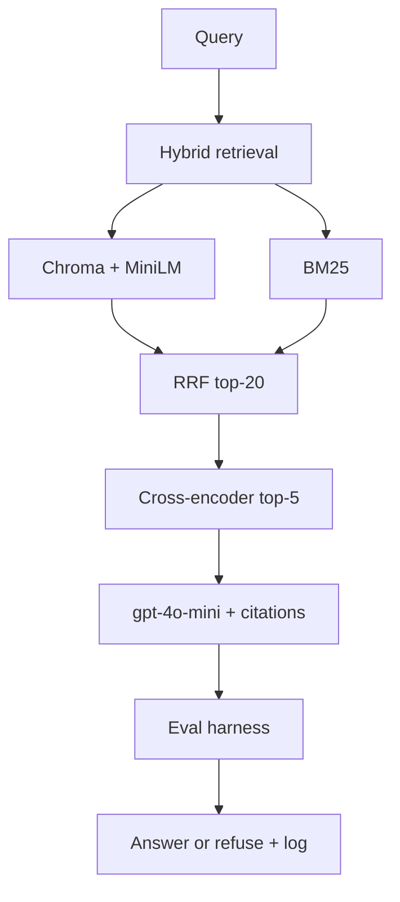

# FinRAG Eval

RAG over SEC 10-K / 10-Q filings with hybrid retrieval, cross-encoder reranking, grounded generation, and a logged eval harness.

**[Live demo →](https://financial-rag-eval.streamlit.app/)** · Streamlit Cloud · set `OPENAI_API_KEY` in secrets

## Architecture



**Models:** embeddings `all-MiniLM-L6-v2` · rerank `ms-marco-MiniLM-L-6-v2` · generation + LLM judges `gpt-4o-mini`

## Results (22-query eval, 2026-06-28)

| Metric | Value |
|--------|-------|
| Faithfulness | **0.75** |
| Chunk recall | **0.93** |
| Response relevance | **0.51** |
| Retrieval latency | **742 ms** |
| Total latency | **1,368 ms** |
| Top-1 relevance | **72% → 83%** after reranking |
| Hallucinations caught | **1 / 22** |
| Refusals | **5 / 22** |

Extractive baseline + cross-encoder judges (`scripts/run_eval_baseline.py`). LLM end-to-end: `scripts/run_eval.py` with `OPENAI_API_KEY`.

**Failure case:** NVDA answer cites *$10.32B fiscal 2023*; filing says *$75.2B fiscal 2026* → numeric grounding refuses. `python scripts/demo_failure_case.py`

**Corpus:** 8 tickers (AAPL, TSLA, JPM, MSFT, GOOGL, AMZN, NVDA, META) · 16 filings · 3,013 chunks

## Run locally

```bash
python3 -m venv .venv && source .venv/bin/activate
pip install -r requirements.txt
cp .env.example .env   # OPENAI_API_KEY, SEC_USER_AGENT
```

Indexes are pre-built in `data/chroma/` and `data/bm25/`. Re-ingest only if needed:

```bash
python scripts/ingest_corpus.py
streamlit run app.py              # UI
uvicorn api.main:app --port 8000  # API (optional)
python scripts/run_eval_baseline.py
```

## Deploy (Streamlit Cloud)

Repo `sanialolidk/financial-rag-eval` · main file `app.py` · secret `OPENAI_API_KEY`