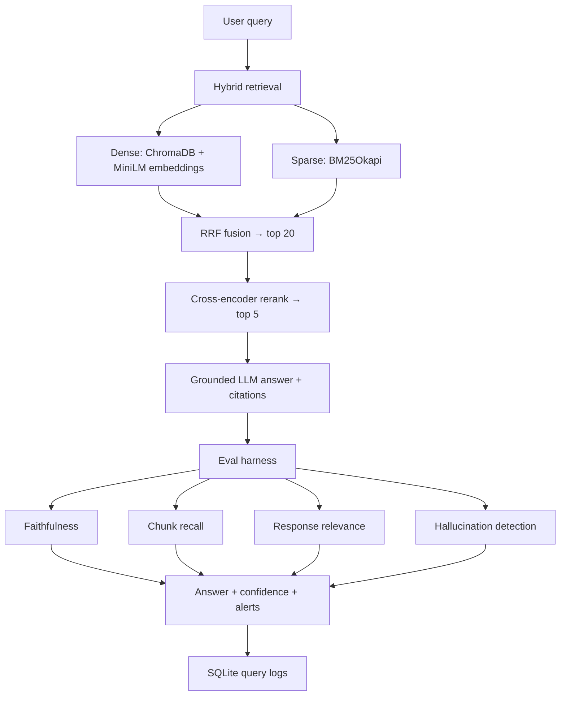

# FinRAG Eval — Financial Document RAG + Evaluation Harness

Production-minded RAG over SEC 10-K / 10-Q filings: hybrid retrieval, cross-encoder reranking, grounded generation, and a logged evaluation harness (faithfulness, chunk recall, response relevance, hallucination detection).

Use case: analysts and compliance teams querying earnings filings, risk factors, and segment revenue inside 10-Ks/10-Qs — the same document-QA pattern used in internal research portals and regulatory intelligence tools.

**[Live demo →](https://financial-rag-eval.streamlit.app/)** (Streamlit Cloud — set `OPENAI_API_KEY` in app secrets)

## Architecture



```
Query → [Chroma dense + BM25 sparse] → RRF top-20 → cross-encoder rerank top-5
      → gpt-4o-mini (cited answer) → RAGAS faithfulness + recall + relevance judges
      → refuse if faithfulness < 0.55 or hallucination detected → SQLite log
```

## Models

| Role | Model | Notes |
|------|-------|-------|
| **Embeddings** | `sentence-transformers/all-MiniLM-L6-v2` | Local, 384-dim, cosine index in Chroma |
| **Reranking** | `cross-encoder/ms-marco-MiniLM-L-6-v2` | Top-20 → top-5; also offline faithfulness fallback |
| **Answer generation** | `gpt-4o-mini` | Grounded prompts, mandatory chunk citations |
| **Eval judges (LLM)** | `gpt-4o-mini` | RAGAS claim decomposition + relevance + hallucination |
| **Eval judges (offline)** | `cross-encoder/ms-marco-MiniLM-L-6-v2` | Used when no API key; numeric grounding for $/fiscal-year |

Reproduce eval: `python scripts/run_eval_baseline.py` (offline) or `python scripts/run_eval.py` (LLM end-to-end).

### Anti-hallucination design

| Layer | Mechanism |
|-------|-----------|
| Retrieval | Hybrid dense+BM25 reduces missed-keyword blind spots |
| Reranking | Cross-encoder filters irrelevant chunks before generation |
| Generation | Strict system prompt; mandatory chunk citations; `INSUFFICIENT_CONTEXT` refusal |
| Post-gen gate | Faithfulness < 0.55 → refuse answer |
| Post-gen gate | Numeric grounding + hallucination detector → refuse |
| Confidence | Combines rerank relevance + faithfulness; low confidence → refuse |

## Corpus

| Companies | Tickers |
|-----------|---------|
| Apple, Tesla, JPMorgan, Microsoft, Alphabet, Amazon, NVIDIA, Meta | AAPL, TSLA, JPM, MSFT, GOOGL, AMZN, NVDA, META |

**Filing types:** 10-K, 10-Q (via SEC EDGAR)  
**Optional:** earnings transcripts in `data/corpus/transcripts/` as `{TICKER}_{DATE}_transcript.txt`

## Benchmark results

**22 golden queries** · 16 SEC filings · 3,013 chunks · measured 2026-06-28

| Metric | Value |
|--------|-------|
| **Avg faithfulness** | **0.75** |
| **Avg chunk recall** | **0.93** |
| **Avg response relevance** | **0.51** |
| **Mean retrieval latency** | **742 ms** (hybrid + rerank) |
| **Mean total latency** | **1,368 ms** (retrieval + extractive answer + eval) |
| **Top-1 chunk relevance** | **72% → 83%** after reranking (+15.5%) |
| **Hallucinations caught** | **1 / 22** queries |
| **Refusals** | **5 / 22** (low relevance or impossible query) |
| **Eval queries** | 22 |

Eval mode for the table above: **extractive baseline** with **cross-encoder judges** (`scripts/run_eval_baseline.py`). This measures retrieval + eval harness without API cost. For **gpt-4o-mini** end-to-end scores (generation + LLM judges), run `python scripts/run_eval.py` with `OPENAI_API_KEY`.

Artifacts: `data/eval/eval_summary.json`, `data/eval/rerank_ablation.json`, `data/eval/retrieval_benchmark.json`

### Documented failure case

**NVDA Data Center revenue (prior-year hallucination):** Answer cites *"$10.32 billion in fiscal 2023"* but retrieved NVDA 10-Q states *"$75.2 billion"* (fiscal 2026). Numeric grounding flags the wrong amount and year → `HALLUCINATION` alert → pipeline refuses.

`python scripts/demo_failure_case.py` → `data/eval/failure_case_nvda.json`

## Quick start

```bash
cd financial-rag-eval
python3 -m venv .venv && source .venv/bin/activate
pip install -r requirements.txt
cp .env.example .env   # OPENAI_API_KEY + SEC_USER_AGENT="Name email@domain.com"
python scripts/ingest_corpus.py   # or use bundled indexes in data/chroma + data/bm25
```

```bash
./scripts/start_api.sh    # :8000
./scripts/start_ui.sh     # :8501
python scripts/run_eval_baseline.py   # populate benchmark JSON (no API key)
python scripts/run_eval.py            # full LLM eval (needs API key)
```

## API endpoints

| Method | Path | Description |
|--------|------|-------------|
| GET | `/health` | Corpus + index status |
| POST | `/query` | `{"question": "...", "run_eval": true}` |
| POST | `/eval/run` | `{"limit": 10}` — run golden eval set |
| GET | `/metrics` | Recent query logs + latest eval summary |
| GET | `/config` | Retrieval + alert thresholds |

## Eval methodology

Golden set: `app/evaluation/eval_dataset.json` — 8 tickers + 1 impossible query (should refuse).

| Metric | Definition |
|--------|------------|
| **Faithfulness** | RAGAS: decompose answer → verify each claim against chunks |
| **Chunk recall** | Retrieved chunks contain expected eval keywords |
| **Response relevance** | Does the answer address the question? |
| **Hallucination** | Unsupported claims + numeric/fiscal-year grounding |
| **Chunk relevance** | Cross-encoder score per retrieved chunk |

Alerts: `LOW_FAITHFULNESS` < 0.7 · `LOW_CHUNK_RECALL` < 0.5 · `HALLUCINATION`

## Deploy live demo (Streamlit Cloud)

1. [share.streamlit.io](https://share.streamlit.io) → **New app** → `sanialolidk/financial-rag-eval`
2. Main file: `app.py`
3. Secrets: `OPENAI_API_KEY = "sk-..."`
4. Indexes are bundled — no ingest on deploy

## Project layout

```
financial-rag-eval/
├── app.py              # Streamlit Cloud entrypoint
├── app/                # ingestion, retrieval, generation, evaluation, pipeline
├── api/main.py         # FastAPI backend
├── ui/streamlit_app.py # Local UI (calls API)
└── scripts/            # ingest, eval, benchmarks
```

## Known failure modes

1. **OpenAI cost** — full eval with LLM judges costs ~$0.02–0.05 per 22-query run on gpt-4o-mini; use `--limit` or baseline eval for CI.
2. **Stale filings** — re-run `ingest_corpus.py` quarterly.
3. **Cross-ticker questions** — retrieval may miss one ticker; chunk recall alert fires.
4. **Prior-year numbers** — numeric grounding refuses wrong fiscal year (see NVDA case).
5. **Impossible queries** — system refuses when context is irrelevant.

## Stack

Python 3.11+, FastAPI, Streamlit, ChromaDB, sentence-transformers, rank-bm25, OpenAI, SQLite.

SEC filings are public domain; respect [SEC fair access policy](https://www.sec.gov/os/webmaster-faq#developers) when re-ingesting.